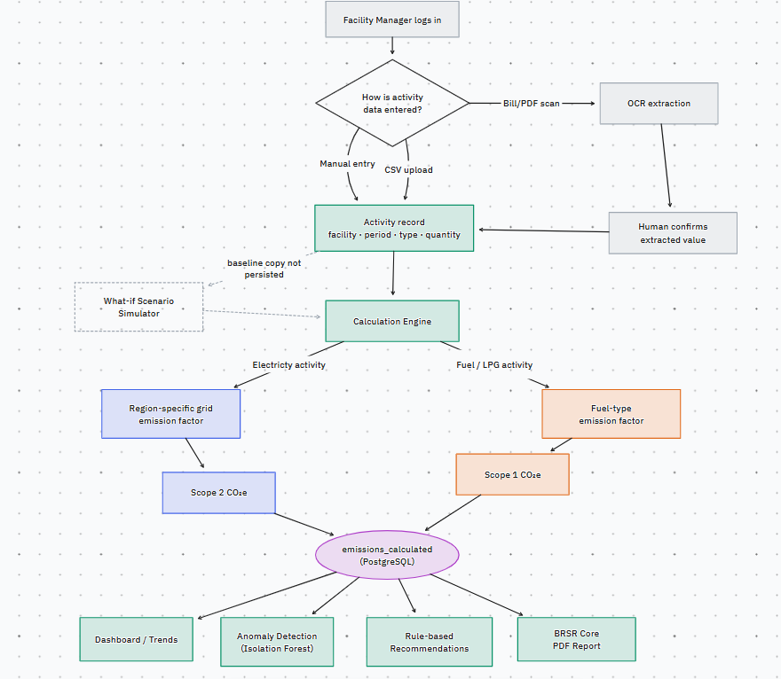

# CarbonTrace
Facility-level activity data (electricity bills, fuel/LPG purchase records) is entered manually, uploaded as CSV, or extracted from bill scans via OCR. A calculation engine converts that activity data into Scope 1 / Scope 2 CO2e using region-specific (electricity) or fuel-type-specific (direct combustion) emission factors. Results feed a dashboard, anomaly detection, rule-based reduction recommendations, a what-if scenario simulator, and a BRSR Core-style PDF report.

## How it works



## Tech stack

**Frontend**
- React 18 + Vite
- Tailwind CSS
- React Router, TanStack Query (React Query), Axios
- Recharts for charts

**Backend**
- Python 3.11, managed with [uv](https://github.com/astral-sh/uv)
- FastAPI + Uvicorn
- Pydantic v2 (request/response models + settings)
- SQLAlchemy 2.0 with psycopg (Postgres)

**Auth**
- Short-lived JWT access tokens (python-jose), kept in memory on the client
- Long-lived refresh tokens in an HttpOnly cookie, hashed and stored in Postgres
- Passwords hashed with bcrypt (passlib)
- Roles: Admin, Facility Manager, Auditor

**Data + calculation**
- PostgreSQL — users, roles, facilities, activity records, emission factors,
  calculated emissions, anomalies, recommendations, scenarios
- OCR extraction for bill scans (electricity, diesel/fuel, LPG)
- Emission factor lookup: region-specific for electricity (Scope 2),
  fuel-type-specific for direct combustion (Scope 1)

**Everything else**
- scikit-learn (Isolation Forest) for anomaly detection on calculated emissions
- ReportLab for the BRSR Core-aligned PDF report
- Docker Compose, Nginx

## Requirements

- Backend: Python 3.11+ and `uv`
- Frontend: Node 20+ and npm
- A reachable PostgreSQL instance
- A `.env` file (copy `.env.example`)

## Running it

With Docker:

```bash
cp .env.example .env
docker compose up --build
```

Dashboard (through Nginx): http://localhost

Create the first user (there's no public sign-up):

```bash
docker compose exec backend python create_admin.py \
  --email you@example.com --password "change-me" --role admin
```

Working on the backend on its own:

```bash
cd backend
uv sync
uv run uvicorn main:app --reload
# Swagger UI: http://localhost:8000/docs
```

## Project layout

```
backend/      FastAPI app
  routers/    HTTP endpoints (auth, facilities, activity, emissions,
              anomalies, recommendations, scenarios, reports)
  models/     SQLAlchemy models
  schemas/    Pydantic request/response models
  services/   calculation engine, OCR pipeline, anomaly engine,
              recommendation rules, scenario simulator, PDF generation
frontend/     React + Vite dashboard
nginx/        reverse proxy config
docker-compose.yml
```

## Contributing

**Open an issue first.** Before starting work, file a GitHub issue describing
what you're doing and which part of the system it touches.

**Branches**
- `main` — stable, only updated through pull requests
- `dev` — active development; feature branches merge here
- `feature/<name>` — one branch per piece of work, branched off `dev`

```bash
git checkout dev
git pull
git checkout -b feature/my-thing
```

**Commits.** Keep them small and write a clear message. We use simple prefixes:
`feat:`, `fix:`, `chore:`, `ci:`, `docs:`. One logical change per commit.

**Pull requests.** Open the PR against `dev` (not `main`), link the issue with
`Closes #123`, and make sure CI is green before asking for a merge.
- no secrets committed (use `.env`, and update `.env.example` if you add a variable)
- backend routes have Pydantic request/response models
- React components are function components with hooks
- the linter passes

**CI.** GitHub Actions runs on every PR into `dev`/`main`: the backend gets linted
(`ruff`) and import-checked, and the frontend dependencies get installed.

**Code style.** Backend is formatted/linted with `ruff` (line length 100). Keep
comments minimal and about the code, not the roadmap. Don't hardcode secrets and
don't run anything with debug mode on in production.

```bash
cd backend
uv sync                 # installs deps incl. ruff/pytest
uv run ruff check .     # lint before you push
```