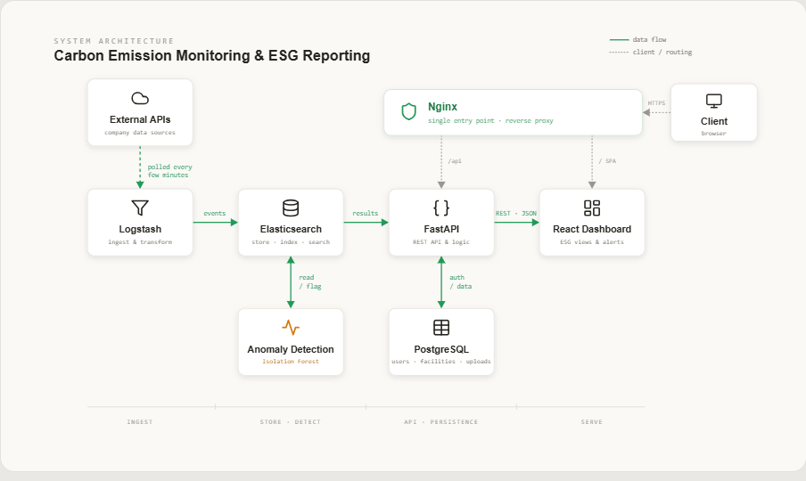

# CarbonTrace

CarbonTrace is a carbon-emission monitoring and ESG reporting tool. It collects emission data from a few public APIs pushes that data through Logstash into Elasticsearch, runs an Isolation Forest over it to catch unusual spikes, and serves the whole thing to a React dashboard. You can also export an ESG summary as a PDF.

## How it works



There are two data stores on purpose: PostgreSQL handles the relational, transactional
stuff (accounts, roles, upload records), and Elasticsearch handles the high-volume
time-series readings. The poller is its own process so it runs once, not once per web
worker.

## Tech stack

**Frontend**
- React 18 + Vite
- Tailwind CSS
- React Router, TanStack Query (React Query), Axios
- Recharts for charts

**Backend**
- Python 3.11, managed with [uv](https://github.com/astral-sh/uv)
- FastAPI + Uvicorn
- Pydantic v2 (request/response models + settings)
- SQLAlchemy 2.0 with psycopg (Postgres)
- APScheduler + httpx for the poller

**Auth**
- Short-lived JWT access tokens (python-jose), kept in memory on the client
- Long-lived refresh tokens in an HttpOnly cookie, hashed and stored in Postgres
- Passwords hashed with bcrypt (passlib)
- Roles: Admin, Facility Manager, Auditor

**Data + pipeline**
- PostgreSQL — users, roles, facilities, sessions, uploads
- Elasticsearch — `emissions-live`, `emissions-uploads`, `emissions-anomalies`
- Logstash for ingestion, Kibana for poking at the indices

**Everything else**
- scikit-learn (Isolation Forest), NumPy, pandas
- ReportLab for the PDF reports
- Docker Compose, Nginx, aimed at a single GCP e2-medium VM

## Requirements

To run the full stack with Docker (the easy path):
- Docker Engine 24+ with Compose v2 (Docker Desktop on Windows/macOS is fine)
- ~4 GB of RAM free for the containers. Elasticsearch is capped at a 512 MB heap,
  but the JVMs plus everything else need headroom — 8 GB is comfortable.
- ~3 GB of free disk for the ELK images
- A `.env` file (copy `.env.example`). External API keys are optional; without them
  the poller just uses the sensor simulator.

To work on the code directly (without Docker):
- Backend: Python 3.11+ and `uv`
- Frontend: Node 20+ and npm
- A reachable PostgreSQL and Elasticsearch if you want the data paths to work
  (pointing at the Docker ones is fine)

## Running it

With Docker:

```bash
cp .env.example .env     # then fill in values; API keys can stay blank
docker compose up --build
```

Once it's up:
- Dashboard (through Nginx): http://localhost
- Kibana: http://localhost:5601

The first poll runs on startup, so data starts showing up within a minute or two.

Create the first user (there's no public sign-up):

```bash
docker compose exec backend python create_admin.py \
  --email you@example.com --password "change-me" --role admin
```

Working on the backend on its own:

```bash
cd backend
uv sync
uv run uvicorn main:app --reload
# Swagger UI: http://localhost:8000/docs
```

## Project layout

```
backend/      FastAPI app
  routers/    HTTP endpoints (auth, emissions, anomalies, upload, reports)
  models/     SQLAlchemy models
  schemas/    Pydantic request/response models
  services/   ES queries, anomaly engine, PDF generation
  worker/     the standalone poller (sensor sim + API clients)
frontend/     React + Vite dashboard
elk/          Logstash pipeline + Kibana
nginx/        reverse proxy config
docker-compose.yml
```

## Contributing

The repo is small and the workflow is light, but a few rules keep it tidy.

**Open an issue first.** Before starting work, file a GitHub issue (use the
"Feature work" or "Bug" template) describing what you're doing and which part of the
system it touches. That's how we avoid two people on the same thing.

**Branches**
- `main` — stable, only updated through pull requests
- `dev` — active development; feature branches merge here
- `feature/<name>` — one branch per piece of work, branched off `dev`

```bash
git checkout dev
git pull
git checkout -b feature/my-thing
```

**Commits.** Keep them small and write a clear message. We use simple prefixes:
`feat:`, `fix:`, `chore:`, `ci:`, `docs:`. One logical change per commit.

**Pull requests.** Open the PR against `dev` (not `main`), link the issue with
`Closes #123`, and make sure CI is green before asking for a merge. The PR template
has a short checklist; the things that actually matter:
- no secrets committed (use `.env`, and update `.env.example` if you add a variable)
- backend routes have Pydantic request/response models
- React components are function components with hooks
- the linter passes

**CI.** GitHub Actions runs on every PR into `dev`/`main`: the backend gets linted
(`ruff`) and import-checked, and the frontend dependencies get installed. Broken
checks block the merge.

**Code style.** Backend is formatted/linted with `ruff` (line length 100). Keep
comments minimal and about the code, not the roadmap. Don't hardcode secrets and
don't run anything with debug mode on in production.

To set up the backend for development:

```bash
cd backend
uv sync                 # installs deps incl. ruff/pytest
uv run ruff check .     # lint before you push
```
