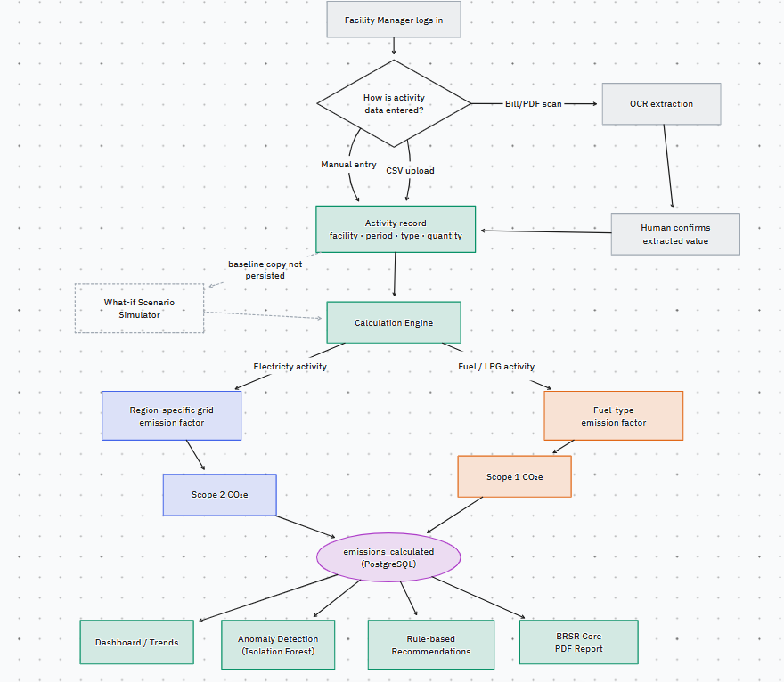

# CarbonTrace

Carbon emission monitoring and ESG reporting. Activity data (electricity bills, fuel/LPG records) is entered manually, uploaded as CSV, or extracted from bill scans via OCR. A calculation engine converts it to Scope 1/2 CO₂e using region-specific emission factors. Results feed a dashboard, anomaly detection, rule-based recommendations, a what-if scenario simulator, and a BRSR Core PDF report.



## Stack

| Layer | Tech |
|---|---|
| Frontend | React 18 + Vite, Tailwind, React Router, TanStack Query, Recharts |
| Backend | Python 3.11 (uv), FastAPI, SQLAlchemy 2.0, Pydantic v2 |
| Database | PostgreSQL |
| Auth | JWT access tokens + HttpOnly refresh cookie, bcrypt passwords, role-based access |
| Infra | Docker Compose, Nginx |

## Requirements

- Docker and Docker Compose, **or**
- Python 3.11+ with `uv`, Node 20+ with npm, and a running PostgreSQL instance

## Installation

### Docker (recommended)

```bash
cp .env.example .env          # fill in secrets
docker compose up --build
```

App: http://localhost  
API docs: http://localhost/api/docs

Create the first admin (no public sign-up):

```bash
docker compose exec backend python create_admin.py \
  --email you@example.com --password "change-me" --role admin
```

### Local development

**Backend:**

```bash
cd backend
uv sync
uv run uvicorn main:app --reload
# http://localhost:8000/docs
```

**Frontend:**

```bash
cd frontend
npm install
npm run dev
# http://localhost:5173 (proxies /api → localhost:8000)
```

## Project layout

```
backend/      FastAPI app
  routers/    HTTP endpoints
  models/     SQLAlchemy models
  schemas/    Pydantic request/response models
  services/   calculation, OCR, anomaly detection, recommendations, PDF
frontend/     React + Vite dashboard
nginx/        reverse proxy config
docker-compose.yml
```

## Contributing

Open an issue before starting work. Branch off `dev` as `feature/<name>`, PR back into `dev`. CI (lint + build) must be green.

```bash
cd backend && uv run ruff check .    # lint check before pushing
```
