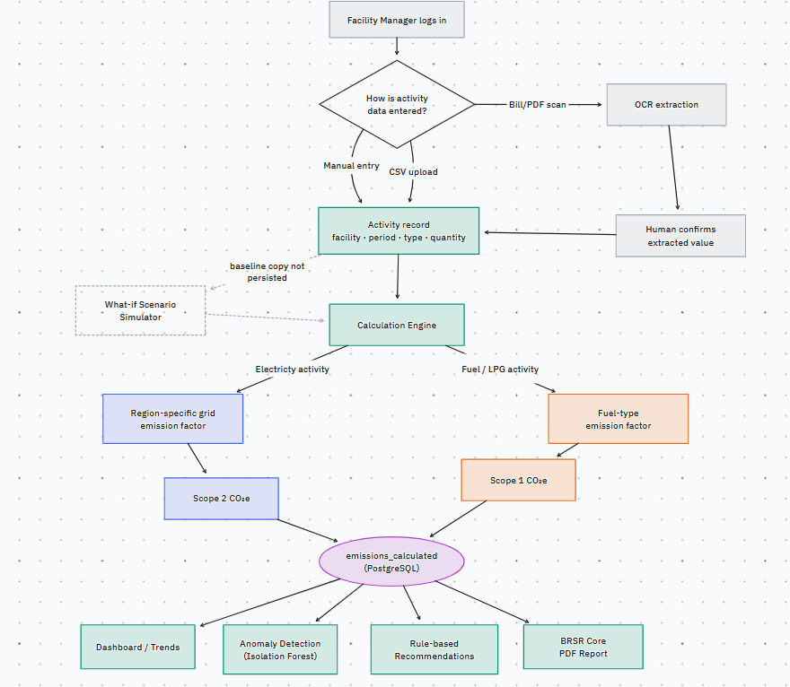

# Development

## Architecture

- `frontend/src/pages`: dashboard, intake review, trends, anomalies, and report download.
- `backend/routers`: authenticated HTTP endpoints.
- `backend/services`: workbook normalization, draft staging, calculations, and PDF generation.
- `backend/models`: PostgreSQL records and constraints.
- `backend/tests`: synthetic workbook and calculation regressions.

Flow: file -> validated draft -> human confirmation -> activity record -> calculated emissions -> dashboard and PDF.



## Verification

```sh
cd backend
uv run --frozen ruff check .
uv run --frozen pytest -q
```

Database tests require a dedicated PostgreSQL database whose name ends in `_e2e`. Set `TEST_DATABASE_URL` before testing. Tests reset test data and must never target a presentation database. Database tests skip when PostgreSQL is unavailable.

```sh
cd frontend
npm ci
npm run build
npm test
```

On Windows, `run_audit.ps1 -TestDatabaseUrl <test-DSN>` runs these checks together. Synthetic fixtures are generated in memory, so private bills are unnecessary for tests.

Use short conventional commit messages, keep changes focused, and run relevant checks before committing. Do not commit credentials, workbooks, databases, or generated build output.
